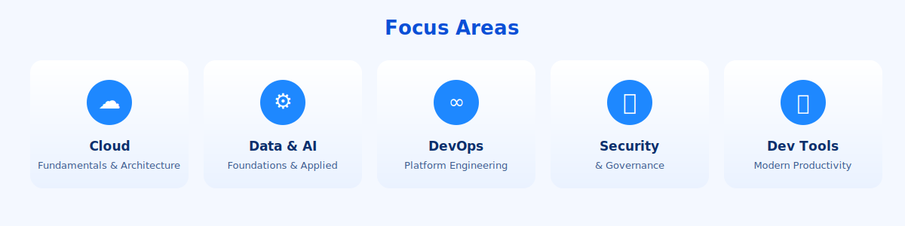

# Technology Education Center (TEC) - Cloud2BR

[Cloud2BR](https://github.com/Cloud2BR)

Last updated: 2026-07-21

----------

  

> The Technology Education Center (TEC) of Cloud2BR is a technology learning and enablement platform dedicated to making cloud and modern technology education accessible to everyone.

TEC provides self-paced learning resources, hands-on labs, videos, workshops, and instructor-led programs for individuals, teams, and organizations.

Through open resources, structured courses, and practical experiences, TEC helps learners build real-world skills across cloud platforms and emerging technologies.

## Mission

Enable people and organizations to explore, learn, and apply technology with confidence.

## Learning Experience

  

- Self-paced learning paths and practical guides
- Hands-on labs and sandbox exercises
- Video explainers and workshop materials
- Instructor-led programs for teams and organizations
- Open community resources for continuous learning

## Focus Areas

  

- Cloud fundamentals and architecture
- Data and AI foundations
- DevOps and platform engineering
- Security and governance practices
- Productivity with modern developer tools

## Who TEC Supports

- Individual learners and career switchers
- Technical teams building new capabilities
- Organizations upskilling at scale
- Community leaders running local learning programs

## Start Here

- Explore repositories for guides, labs, and workshop content
- Follow structured paths to move from fundamentals to applied projects
- Use sample assets to practice and adapt for your own environment

## Collaboration

TEC welcomes collaboration through issues, pull requests, and knowledge-sharing contributions.

> [!NOTE]
> Repository content is designed for education, enablement, and practical experimentation. Validate and adapt before production use.

<!-- START BADGE -->

  
  
Refresh Date: 2026-07-21

<!-- END BADGE -->
