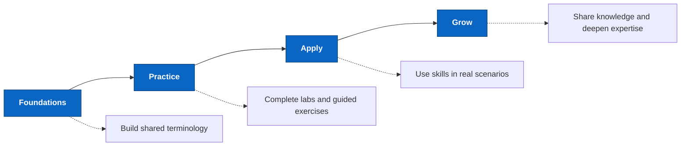

# Technology Education Center (TEC) · Cloud2BR

**Technology education and practical learning for cloud, data, AI, and modern engineering**

----------

> **Mission:** Enable people and organizations to explore, learn, and apply technology with confidence.

## Learning journey

```mermaid
flowchart LR
  F[Foundations]:::step --> P[Practice]:::step --> A[Apply]:::step --> G[Grow]:::step
  F -.-> F1[Build shared terminology]
  P -.-> P1[Complete labs and guided exercises]
  A -.-> A1[Use skills in real scenarios]
  G -.-> G1[Share knowledge and deepen expertise]

  classDef step fill:#0A66C2,stroke:#083c72,color:#ffffff,font-weight:bold
```

## Learning paths and resources

| Category | Description |
|---|---|
| **Learning paths and practical guides** | Structured, self-paced resources from fundamentals to applied skills |
| **Hands-on labs and sandbox exercises** | Safe environments for building and testing technical skills |
| **Videos and workshop materials** | Explainable content for individual and team learning sessions |
| **Instructor-led programs** | Facilitated learning experiences for teams and organizations |
| **Community resources** | Open materials that support continued practice and knowledge sharing |

## Endorsements and certifications

<strong>Microsoft certification study guides</strong>

- <a href="https://github.com/MicrosoftCloudEssentials-LearningHub/AI-900StudyGuide" target="_blank" rel="noopener noreferrer">AI-900: Azure AI Fundamentals</a>
- <a href="https://github.com/MicrosoftCloudEssentials-LearningHub/DP-900StudyGuide" target="_blank" rel="noopener noreferrer">DP-900: Azure Data Fundamentals</a>
- <a href="https://github.com/MicrosoftCloudEssentials-LearningHub/AI-102StudyGuide" target="_blank" rel="noopener noreferrer">AI-102: Azure AI Engineer Associate</a>
- <a href="https://github.com/MicrosoftCloudEssentials-LearningHub/DP-100StudyGuide" target="_blank" rel="noopener noreferrer">DP-100: Designing and Implementing a Data Science Solution on Azure</a>
- <a href="https://github.com/Cloud2BR-MSFTLearningHub/GH-900StudyGuide" target="_blank" rel="noopener noreferrer">GH-900: GitHub Foundations</a>

## Focus areas

| Area | Learning focus |
|---|---|
| **Cloud fundamentals and architecture** | Cloud concepts, solution design, and practical architecture skills |
| **Data and AI foundations** | Data platforms, AI services, and responsible applied AI patterns |
| **DevOps and platform engineering** | Delivery automation, operational practices, and developer productivity |
| **Security and governance** | Secure engineering, identity, policy, and accountable cloud operations |
| **Modern productivity tools** | Collaboration and developer tooling that supports effective teams |

## Who TEC supports

- **Individual learners and career switchers** building practical technology skills
- **Technical teams** developing shared capability for new platforms and workloads
- **Organizations** establishing scalable learning programs
- **Community leaders** delivering local learning experiences and workshops

## Related organizations

| Organization | Purpose |
|---|---|
| <a href="https://github.com/Cloud2BR" target="_blank" rel="noopener noreferrer"><strong>Cloud2BR</strong></a> | Consulting and enablement hub |
| <a href="https://github.com/Cloud2BR-TEC" target="_blank" rel="noopener noreferrer"><strong>Cloud2BR TEC Hub</strong></a> | Technology Education Center |
| <a href="https://github.com/Cloud2BR-MSFTLearningHub" target="_blank" rel="noopener noreferrer"><strong>Cloud2BR MSFT Learning Hub</strong></a> | Open-source Microsoft Cloud Sandbox |

## Get involved

- **Explore** the organization repositories for learning paths, labs, and workshop content
- **Practice** with sample assets and adapt them to your approved learning environment
- **Contribute** through issues, pull requests, and knowledge-sharing activities

> [!IMPORTANT]
> Content is provided **AS-IS** and **WITH ALL FAULTS**. Review and validate materials before production use. For official guidance, refer to Microsoft's documentation or contact <a href="https://support.microsoft.com/contactus?ContactUsExperienceEntryPointAssetId=S.HP.SMC-HOME" target="_blank" rel="noopener noreferrer">Microsoft Sales and Support</a>.

> [!NOTE]
> Content is for **learning, demonstrations, and practical experimentation**. Adapt it to the learner, organization, and environment.

<!-- START BADGE -->

  

<!-- END BADGE -->
